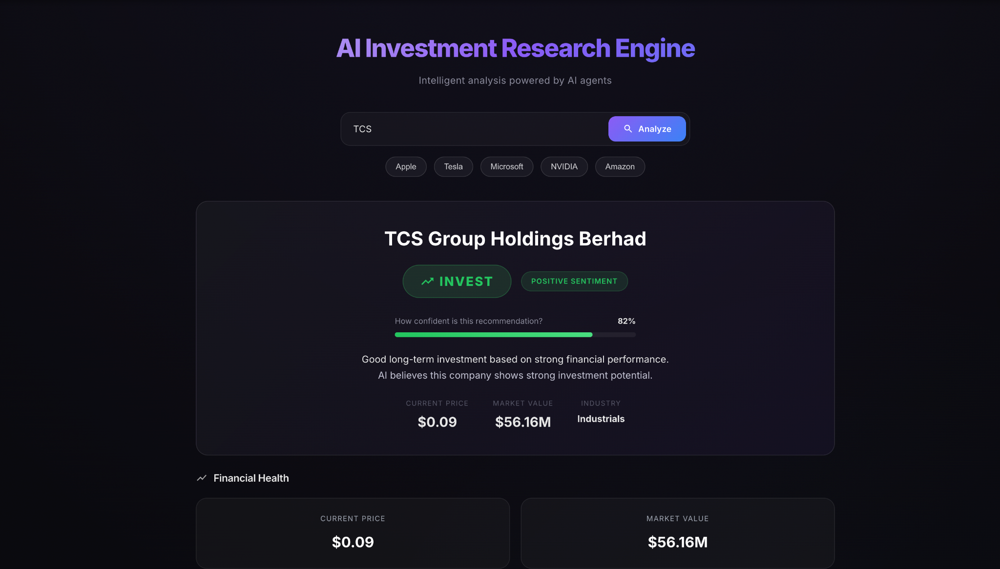
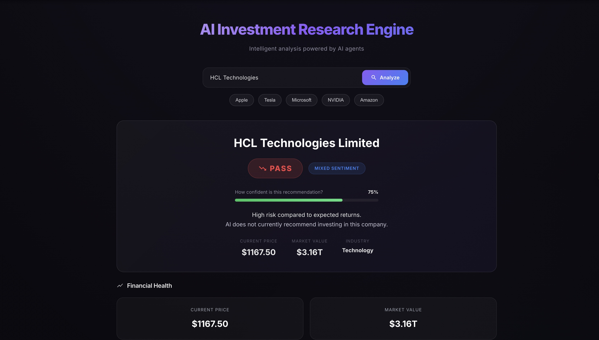

# AI Investment Research Engine
### A Multi-Agent Investment Recommendation System using LangGraph and OpenAI

---

## Live Demo

### Frontend (Vercel)

https://ai-invest-ment-research-engine.vercel.app/

### Backend (Render)

https://ai-investment-research-engine.onrender.com/

---

# Overview

The AI Investment Research Engine is a multi-agent AI application that helps users evaluate whether a company is a suitable investment opportunity.

Instead of relying on a single prompt, the application uses a **LangGraph-based multi-agent workflow**, where each AI agent is responsible for a specific task such as company research, financial analysis, news collection, sentiment analysis, and investment decision making.

The system collects real financial data, analyzes recent news, evaluates market sentiment, and combines all the information to generate an AI-powered investment recommendation.

The results are displayed through a modern React dashboard designed to be simple enough for users with little or no financial knowledge.

---

# Features

- Multi-Agent AI workflow using LangGraph
- Company research using Tavily Search
- Live financial data using Yahoo Finance
- Latest news collection using NewsAPI
- AI-powered sentiment analysis
- AI-generated investment recommendation
- Confidence score for recommendations
- Financial health overview
- AI reasoning
- Key investment risks
- Growth opportunities
- Beginner-friendly financial explanations
- Responsive React dashboard
- Fully deployed on Vercel and Render

---

# Tech Stack

## Frontend

- React.js
- Vite
- Material UI
- Axios
- React Markdown
- CSS3

---

## Backend

- Node.js
- Express.js
- LangChain
- LangGraph

---

## AI Model

- OpenAI GPT-4o-mini

---

## External APIs

- Tavily Search API
- Yahoo Finance API
- NewsAPI
- Financial Modeling Prep (Ticker Lookup)

---

# Project Structure

```
AI_INVESTMENT_RESEARCH_ENGINE

│
├── client
│   ├── src
│   │   ├── assets
│   │   ├── components
│   │   ├── services
│   │   ├── App.jsx
│   │   ├── App.css
│   │   └── main.jsx
│   │
│   └── package.json
│
├── server
│   ├── config
│   ├── graph
│   ├── nodes
│   ├── routes
│   ├── tools
│   ├── index.js
│   └── package.json
│
├── screenshots
│
└── README.md
```

---

# How to Run

## Option 1 – Use the Deployed Application

Frontend

https://ai-invest-ment-research-engine.vercel.app/

Backend

https://ai-investment-research-engine.onrender.com/

No installation is required.

---

## Option 2 – Run Locally

### Clone the repository

```bash
git clone <repository-url>

cd AI_INVESTMENT_RESEARCH_ENGINE
```

---

### Install Backend Dependencies

```bash
cd server

npm install
```

---

### Install Frontend Dependencies

```bash
cd client

npm install
```

---

## Create Environment Variables

Create a `.env` file inside the **server** folder.

```env
OPENAI_API_KEY=your_openai_api_key

TAVILY_API_KEY=your_tavily_api_key

NEWS_API_KEY=your_newsapi_key

FMP_API_KEY=your_financial_modeling_prep_api_key
```

---

## Start Backend

```bash
cd server

npm run dev
```

Backend runs on

```
http://localhost:8000
```

---

## Start Frontend

```bash
cd client

npm run dev
```

Frontend runs on

```
http://localhost:5173
```

---

# How It Works

The application follows a multi-agent architecture built using LangGraph.

```
User

↓

Company Research Agent

↓

Financial Analysis Agent

↓

News Collection Agent

↓

Sentiment Analysis Agent

↓

Decision Making Agent

↓

Investment Recommendation Dashboard
```

Each agent performs one dedicated task and passes its output to the next agent, producing a structured and explainable investment recommendation.

---

# Agent Responsibilities

## 1. Company Research Agent

Uses **Tavily Search** to collect reliable company information and generates:

- Company overview
- Industry
- CEO
- Headquarters
- Founding year
- Products and services
- Market position

---

## 2. Financial Analysis Agent

Uses **Yahoo Finance** to fetch live financial data such as:

- Market Capitalization
- Current Stock Price
- Revenue
- Net Income
- P/E Ratio
- P/B Ratio
- EPS
- ROE
- ROA
- Current Ratio
- Debt-to-Equity
- Gross Margin
- Operating Margin
- Profit Margin

The AI then converts these metrics into beginner-friendly financial insights.

---

## 3. News Collection Agent

Uses **Financial Modeling Prep** to identify the company's ticker symbol and official company name, then retrieves recent company-related news using **NewsAPI**.

The retrieved articles are ranked based on relevance before selecting the most relevant articles for analysis.

---

## 4. Sentiment Analysis Agent

Analyzes every news article individually and determines:

- Positive
- Neutral
- Negative
- Mixed

It also generates an overall market sentiment summary.

---

## 5. Decision Making Agent

Combines:

- Company Profile
- Financial Analysis
- Latest News
- News Sentiment

to generate:

- INVEST or PASS recommendation
- Confidence score
- AI reasoning
- Key risks
- Growth opportunities

---

# Architecture

```
                    React Frontend
                           │
                           ▼
                    Express Backend
                           │
                           ▼
                  LangGraph Workflow
                           │
        ┌────────────────────────────────────┐
        │ Company Research Agent             │
        │ Financial Analysis Agent           │
        │ News Collection Agent              │
        │ Sentiment Analysis Agent           │
        │ Decision Making Agent              │
        └────────────────────────────────────┘
                           │
                           ▼
             Investment Recommendation Dashboard
```

---

# Key Decisions & Trade-offs

## Why LangGraph?

Instead of generating a recommendation from a single LLM prompt, the project uses multiple specialized AI agents connected through LangGraph. This makes the workflow modular, easier to debug, and easier to extend.

---

## Why Yahoo Finance?

Yahoo Finance provides reliable and up-to-date financial information that enables the AI to perform data-driven financial analysis.

---

## Why Tavily Search?

Tavily Search provides accurate company information that helps generate a structured company profile before financial analysis begins.

---

## Why NewsAPI?

Recent news often influences investment decisions. NewsAPI provides timely news articles that allow the AI to evaluate current market sentiment.

---

## Why a Beginner-Friendly Interface?

Most financial dashboards assume prior investment knowledge. This project focuses on explaining financial information in simple language so that even beginner investors can understand the recommendation.

---

# Trade-offs

Due to limited development time, the following features were not implemented:

- Historical stock price charts
- Portfolio tracking
- Company comparison
- User authentication
- Watchlist functionality
- AI-generated PDF reports
- Real-time market streaming

---

# Example Runs

## Example 1 – TCS Group Holdings Berhad

**Recommendation:** INVEST

The AI identified strong financial performance, positive market sentiment, and favorable growth prospects. Based on the available financial data and recent news, the strengths outweighed the risks.



---

## Example 2 – NVIDIA Corporation

**Recommendation:** PASS

Although NVIDIA demonstrated strong business fundamentals, the AI considered the current valuation and investment risks significant enough to recommend waiting before investing.


---

## Example 3 – HCL Technologies

**Recommendation:** PASS

The AI evaluated HCL Technologies using financial performance, market sentiment, and recent news. While the company showed stable fundamentals, the identified risks outweighed the potential upside.



---

# Company Profile

The application also generates a structured company profile using Tavily Search and AI.

The profile includes:

- Company overview
- Industry
- CEO
- Headquarters
- Founding year
- Products and services
- Market position

*(Insert Company Profile Screenshot Here if included.)*

---

# Detailed Financial Analysis

The Financial Analysis Agent uses live Yahoo Finance data and converts complex financial metrics into beginner-friendly insights covering:

- Valuation
- Profitability
- Financial Health
- Overall Financial Summary

*(Insert Financial Analysis Screenshot Here if included.)*

---

# Future Improvements

Given additional development time, the following features would be added:

- Historical stock price visualization
- Portfolio management
- Company comparison dashboard
- Explainable AI with source citations
- User authentication
- Saved investment reports
- AI-generated PDF reports
- Improved sentiment calibration
- Support for additional financial data providers

---

# LLM Usage

This project was developed with the assistance of ChatGPT throughout the design and implementation process.

The LLM was used for:

- Designing the LangGraph workflow
- Prompt engineering
- Backend architecture
- AI agent design
- React component development
- Debugging
- UI/UX improvements
- Documentation
As part of the development process, ChatGPT was used as an AI development assistant to brainstorm ideas, refine prompts, troubleshoot implementation issues, improve the user interface, and document the project.

---

# Author

**Bhumika Narula**

B.Tech Computer Science Engineering

Lovely Professional University
